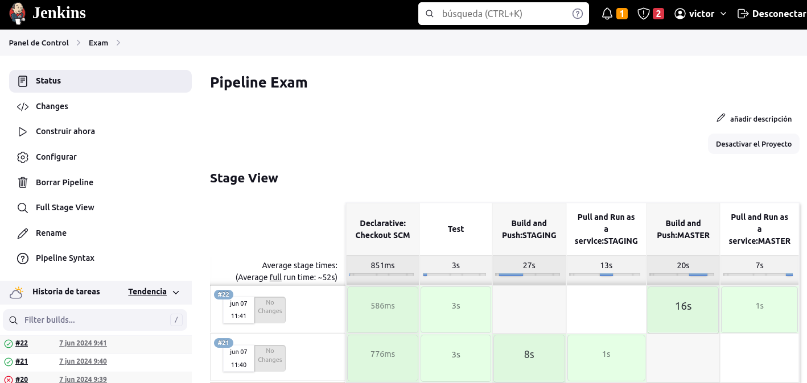
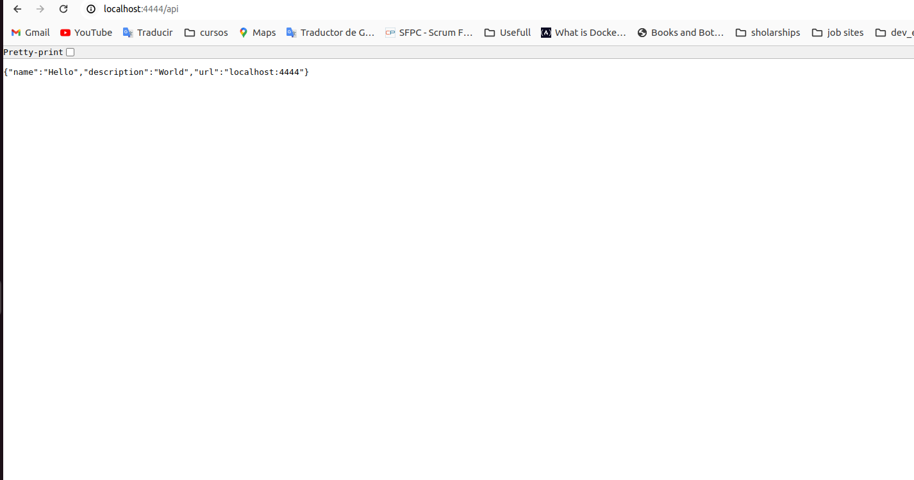

The flow followed 
- Create a docker file for testing and a first stage that always runs for unit test
- Create a docker file for staging and two stages for build the docker image and deploy it to "staging" machine
- Create a docker file for production and two stages for build the docker image and deploy it to "production" machine

Notes:
Was used the same target machine but deploy is mapped to port 4443 and staging to port 4444

Evidence:

